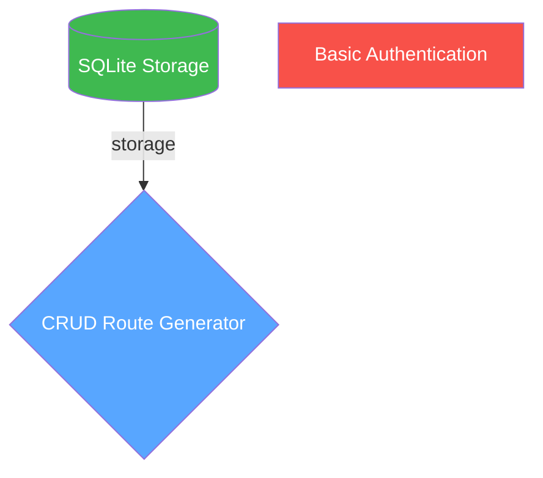

# Architecture

```mermaid
graph TD
    N1[("SQLite Storage")]:::storage
    N2{"CRUD Route Generator"}:::routes
    N3["Basic Authentication"]:::auth
    N1 -->|storage| N2
    classDef auth fill:#f85149,color:white
    classDef storage fill:#3fb950,color:white
    classDef routes fill:#58a6ff,color:white
```
